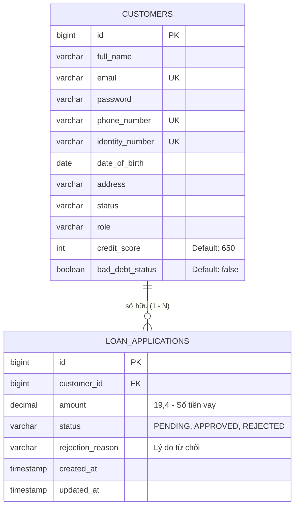

# TÀI LIỆU ĐẶC TẢ YÊU CẦU PHẦN MỀM (SRS)
## HỆ THỐNG DỊCH VỤ NGÂN HÀNG LÕI (CORE BANKING SYSTEM)
### TÍNH NĂNG: DUYỆT HỒ SƠ VAY TÍN CHẤP (LOAN APPLICATION MANAGEMENT)

---

## MỤC LỤC
1. [Giới thiệu & Bối cảnh Nghiệp vụ](#1-giới-thiệu--bối-cảnh-nghiệp-vụ)
2. [Cấu trúc Dữ liệu & Sơ đồ Thực thể (Data Architecture & ERD)](#2-cấu-trúc-dữ-liệu--sơ-đồ-thực-thể-data-architecture--erd)
   - [2.1 Mở rộng Thực thể Customer](#21-mở-rộng-thực-thể-customer)
   - [2.2 Thực thể mới LoanApplication](#22-thực-thể-mới-loanapplication)
   - [2.3 Từ điển Dữ liệu (Data Dictionary)](#23-từ-điển-dữ-liệu-data-dictionary)
3. [Thuật toán Kiểm tra Điều kiện Duyệt Vay (Pseudo-code Algorithm)](#3-thuật-toán-kiểm-tra-điều-kiện-duyệt-vay-pseudo-code-algorithm)
4. [Đặc tả RESTful API Endpoints](#4-đặc-tả-restful-api-endpoints)
5. [Quy định Xử lý Ngoại lệ & HTTP Status Codes (Exception Handling & HTTP 406)](#5-quy-định-xử-lý-ngoại-lệ--http-status-codes-exception-handling--http-406)
6. [Kế Hoạch Phân Chẻ Nhiệm Vụ & Phân Công Chi Tiết (Task Breakdown & Implementation Roadmap)](#6-kế-hoạch-phân-chẻ-nhiệm-vụ--phân-công-chi-tiết-task-breakdown--implementation-roadmap)

---

## 1. Giới thiệu & Bối cảnh Nghiệp vụ

Trong chiến lược số hóa quy trình nghiệp vụ ngân hàng, Ngân hàng CoreBanking triển khai mô hình quản lý và phê duyệt **Hồ sơ Vay Tín chấp (Loan Application)** tự động hóa. 

### Mục tiêu hệ thống:
- Cho phép **Khách hàng (CUSTOMER)** tạo yêu cầu vay vốn tín chấp trực tuyến với số tiền mong muốn.
- Quản lý thông tin tín dụng khách hàng bao gồm **Điểm tín dụng (Credit Score)** và **Trạng thái nợ xấu (Bad Debt Status)**.
- Cho phép **Nhân viên Tín dụng (ADMIN)** tiến hành duyệt hồ sơ vay.
- **Tự động hóa kiểm soát rủi ro (Risk Engine)**: Khi Admin bấm duyệt, hệ thống tự động đánh giá lịch sử tín dụng của khách hàng. Nếu `Credit Score < 600` hoặc `Bad Debt Status = TRUE`, hệ thống sẽ ngăn chặn việc duyệt vay và trả về lỗi ngoại lệ kinh doanh với **HTTP Status Code 406 (Not Acceptable)** kèm thông báo chi tiết.

---

## 2. Cấu trúc Dữ liệu & Sơ đồ Thực thể (Data Architecture & ERD)

### 2.1 Mở rộng Thực thể `Customer`

Thực thể `Customer` (bảng `customers`) được bổ sung 2 trường thông tin để quản lý tín dụng:
- `credit_score` (Integer): Điểm tín dụng của khách hàng. Giá trị mặc định khi đăng ký tài khoản là **650** (thang điểm từ 300 - 850).
- `bad_debt_status` (Boolean): Trạng thái nợ xấu. Mặc định là `FALSE` (0). Nếu là `TRUE` (1), khách hàng đang có nợ xấu trên hệ thống CIC/Ngân hàng.

### 2.2 Thực thể mới `LoanApplication`

Tạo mới thực thể `LoanApplication` (bảng `loan_applications`) lưu trữ các khoản vay tín chấp, liên kết với `Customer` qua quan hệ **Nhiều - 1 (`@ManyToOne`)**:
- Trạng thái hồ sơ vay (`status`) bao gồm các enum: `PENDING` (Chờ duyệt), `APPROVED` (Đã duyệt), `REJECTED` (Từ chối).



---

### 2.3 Từ điển Dữ liệu (Data Dictionary)

#### Bảng 1: `customers` (Sau khi bổ sung trường tín dụng)
| Tên trường | Kiểu dữ liệu | Ràng buộc | Mô tả chi tiết |
| :--- | :--- | :--- | :--- |
| `id` | `BIGINT` | PRIMARY KEY, AUTO_INCREMENT | Mã định danh khách hàng |
| `full_name` | `VARCHAR(100)` | NOT NULL | Họ và tên khách hàng |
| `email` | `VARCHAR(100)` | UNIQUE, NOT NULL | Địa chỉ Email đăng nhập |
| `password` | `VARCHAR(100)` | NOT NULL | Mật khẩu mã hóa BCrypt |
| `phone_number` | `VARCHAR(20)` | UNIQUE, NOT NULL | Số điện thoại liên lạc |
| `identity_number` | `VARCHAR(20)` | UNIQUE, NOT NULL | Số CMND / CCCD |
| `date_of_birth` | `DATE` | NULL | Ngày tháng năm sinh |
| `address` | `VARCHAR(255)` | NULL | Địa chỉ cư trú |
| `status` | `VARCHAR(20)` | NOT NULL | Trạng thái tài khoản (ACTIVE, LOCKED) |
| `role` | `VARCHAR(20)` | NOT NULL | Vai trò (CUSTOMER, ADMIN) |
| **`credit_score`** | **`INT`** | **NOT NULL, DEFAULT 650** | **Điểm tín dụng (Ngưỡng duyệt >= 600)** |
| **`bad_debt_status`** | **`BOOLEAN`** | **NOT NULL, DEFAULT FALSE** | **Trạng thái nợ xấu (true: Có nợ xấu)** |

#### Bảng 2: `loan_applications` (Bảng mới)
| Tên trường | Kiểu dữ liệu | Ràng buộc | Mô tả chi tiết |
| :--- | :--- | :--- | :--- |
| `id` | `BIGINT` | PRIMARY KEY, AUTO_INCREMENT | Mã định danh hồ sơ vay |
| `customer_id` | `BIGINT` | FOREIGN KEY (customers.id), NOT NULL | Mã khách hàng nộp hồ sơ vay |
| `amount` | `DECIMAL(19,4)` | NOT NULL, CHECK (amount > 0) | Số tiền đề nghị vay vốn (VND) |
| `status` | `VARCHAR(20)` | NOT NULL, DEFAULT 'PENDING' | Trạng thái (PENDING, APPROVED, REJECTED) |
| `rejection_reason` | `VARCHAR(255)` | NULL | Lý do chi tiết bị từ chối nếu không đủ điều kiện |
| `created_at` | `TIMESTAMP` | NOT NULL, DEFAULT CURRENT_TIMESTAMP | Thời điểm nộp hồ sơ |
| `updated_at` | `TIMESTAMP` | NULL | Thời điểm duyệt / từ chối hồ sơ |

#### Bảng 3: Danh mục Chỉ mục CSDL (Database Indexing Strategy)
| Tên Index | Bảng CSDL | Các trường đánh Index | Kiểu Index | Mục đích tối ưu hóa |
| :--- | :--- | :--- | :--- | :--- |
| `idx_customer_credit_bad_debt` | `customers` | `credit_score, bad_debt_status` | Composite Index | Tăng tốc độ truy vấn thuật toán kiểm tra Credit Score < 600 & Bad Debt |
| `idx_customer_email` | `customers` | `email` | B-Tree Index | Tăng tốc độ xác thực đăng nhập & tra cứu khách hàng |
| `idx_loan_customer_status` | `loan_applications` | `customer_id, status` | Composite Index | Tối ưu hóa truy vấn lịch sử khoản vay theo Customer và Trạng thái |
| `idx_loan_status_created` | `loan_applications` | `status, created_at` | Composite Index | Tối ưu hóa báo cáo danh sách khoản vay chờ duyệt cho Admin |


---

## 3. Thuật toán Kiểm tra Điều kiện Duyệt Vay (Pseudo-code Algorithm)

Dưới đây là đặc tả thuật toán xử lý nghiệp vụ phê duyệt hồ sơ vay tín chấp bởi Admin:

```pascal
ALGORITHM ApproveLoanApplication(loanId)
INPUT: 
    loanId: Long (Mã định danh hồ sơ vay cần duyệt)
OUTPUT: 
    LoanApplicationResponse DTO (Nếu thành công) 
    hoặc Ném Ngoại Lệ Nghiệp Vụ HTTP 406 (Nếu vi phạm điều kiện tín dụng)

BEGIN
    // Bước 1: Trích xuất thông tin hồ sơ vay từ Database
    loan = LoanApplicationRepository.findById(loanId)
    IF loan IS NULL THEN
        RAISE LoanApplicationNotFoundException("Không tìm thấy hồ sơ vay với ID: " + loanId)
    END IF

    // Bước 2: Kiểm tra trạng thái hiện tại của hồ sơ
    IF loan.status != "PENDING" THEN
        RAISE BusinessException(400, "Hồ sơ vay đã được xử lý (APPROVED hoặc REJECTED) trước đó.")
    END IF

    // Bước 3: Lấy thông tin khách hàng đăng ký vay
    customer = loan.customer
    IF customer IS NULL THEN
        RAISE BusinessException(404, "Không tìm thấy thông tin khách hàng sở hữu khoản vay.")
    END IF

    // Bước 4: Kiểm tra điều kiện Tín dụng 1 - Điểm tín dụng (Credit Score)
    IF customer.creditScore IS NULL OR customer.creditScore < 600 THEN
        // Cập nhật trạng thái khoản vay thành REJECTED
        loan.status = "REJECTED"
        loan.rejectionReason = "Từ chối duyệt: Điểm tín dụng không đủ (" + customer.creditScore + " < 600 điểm)"
        LoanApplicationRepository.save(loan)
        
        // Ném Exception dừng luồng xử lý và trả về HTTP 406
        RAISE CreditScoreInsufficientException("Duyệt hồ sơ thất bại: Điểm tín dụng khách hàng (" + customer.creditScore + ") dưới ngưỡng tối thiểu 600")
    END IF

    // Bước 5: Kiểm tra điều kiện Tín dụng 2 - Trạng thái nợ xấu (Bad Debt)
    IF customer.badDebtStatus IS TRUE THEN
        // Cập nhật trạng thái khoản vay thành REJECTED
        loan.status = "REJECTED"
        loan.rejectionReason = "Từ chối duyệt: Khách hàng đang có nợ xấu trên hệ thống tín dụng"
        LoanApplicationRepository.save(loan)
        
        // Ném Exception dừng luồng xử lý và trả về HTTP 406
        RAISE BadDebtCustomerException("Duyệt hồ sơ thất bại: Khách hàng đang thuộc danh sách nợ xấu (Bad Debt)")
    END IF

    // Bước 6: Tất cả điều kiện thỏa mãn -> Phê duyệt hồ sơ vay
    loan.status = "APPROVED"
    loan.rejectionReason = NULL
    loan.updatedAt = CURRENT_TIMESTAMP()
    savedLoan = LoanApplicationRepository.save(loan)

    RETURN MapToLoanApplicationResponse(savedLoan)
END
```

---

## 4. Đặc tả RESTful API Endpoints

| HTTP Method | Endpoint URI | Phân quyền (Role) | Request Body / Params | Expected Response Status | Mô tả nghiệp vụ |
| :--- | :--- | :--- | :--- | :--- | :--- |
| `POST` | `/api/v1/loans` | `CUSTOMER` / `ADMIN` | `{ "customerId": 1, "amount": 50000000 }` | `201 Created` | Tạo mới hồ sơ vay tín chấp (Trạng thái PENDING) |
| `PUT` | `/api/v1/loans/{id}/approve` | `ADMIN` | PathVariable: `id` | `200 OK` | Admin duyệt hồ sơ vay. Thực thi tự động kiểm tra Credit Score & Bad Debt |
| `GET` | `/api/v1/loans/{id}` | `CUSTOMER` / `ADMIN` | PathVariable: `id` | `200 OK` | Xem chi tiết thông tin hồ sơ vay và lý do từ chối (nếu có) |
| `GET` | `/api/v1/loans` | `ADMIN` | Query: `customerId` (Optional) | `200 OK` | Lấy danh sách toàn bộ hồ sơ vay trong hệ thống |

---

## 5. Quy định Xử lý Ngoại lệ & HTTP Status Codes (Exception Handling & HTTP 406)

Hệ thống tuân thủ nghiêm ngặt quy định trả về HTTP Status Codes chuẩn RESTful và yêu cầu đề bài:

1. **`HTTP 406 (Not Acceptable)`**: 
   - Trả về khi khoản vay bị chặn duyệt do **Điểm tín dụng dưới 600** (`CreditScoreInsufficientException`).
   - Trả về khi khoản vay bị chặn duyệt do **Khách hàng có nợ xấu** (`BadDebtCustomerException`).
   - **Response Structure (Cấu trúc trả về)**:
     ```json
     {
       "data": null,
       "message": "Duyệt hồ sơ thất bại: Điểm tín dụng khách hàng (550) dưới ngưỡng tối thiểu 600",
       "code": 406
     }
     ```

2. **`HTTP 400 (Bad Request)`**:
   - Trả về khi dữ liệu đầu vào không hợp lệ (Số tiền vay <= 0, thiếu thông tin bắt buộc, hồ sơ vay không ở trạng thái `PENDING`).

3. **`HTTP 404 (Not Found)`**:
   - Trả về khi không tìm thấy hồ sơ vay hoặc khách hàng tương ứng (`LoanApplicationNotFoundException`).

4. **`HTTP 409 (Conflict)`**:
   - Trả về khi phát sinh tranh chấp ghi đồng thời (Race Condition) khi hai Admin bấm duyệt khoản vay tại cùng một thời điểm (`ObjectOptimisticLockingFailureException`).

---

## 6. Kế Hoạch Phân Chẻ Nhiệm Vụ & Phân Công Chi Tiết (Task Breakdown & Implementation Roadmap)

Để đảm bảo việc triển khai không gây xung đột với Base Code hiện tại và đáp ứng 100% tiêu chí điều hướng AI (Context Management), quy trình được phân chẻ thành 3 nhóm nhiệm vụ chi tiết:

### 📌 Nhiệm vụ 1: Phân tích & Đặc tả Yêu cầu (SRS & Architecture)
- **Task 1.1**: Khảo sát Base Code cũ (`Customer.java`, `BankAccount.java`, `SecurityConfig.java`).
- **Task 1.2**: Lập sơ đồ ERD Mermaid liên kết `Customer` (1) - `LoanApplication` (N).
- **Task 1.3**: Xây dựng Từ điển dữ liệu (Data Dictionary) 4 cột cho các bảng CSDL.
- **Task 1.4**: Viết thuật toán Pseudo-code kiểm tra điều kiện tín dụng (Credit Score < 600 hoặc Bad Debt = true).
- **Task 1.5**: Đặc tả Bảng RESTful API Endpoints 6 cột & Cấu trúc HTTP Status 406.

### 📌 Nhiệm vụ 2: Lập trình Tính năng Backend (Java Spring Boot)
- **Task 2.1 - Custom Exceptions**: 
  - Tạo `CreditScoreInsufficientException.java` (HTTP 406 Not Acceptable).
  - Tạo `BadDebtCustomerException.java` (HTTP 406 Not Acceptable).
  - Tạo `LoanApplicationNotFoundException.java` (HTTP 404 Not Found).
- **Task 2.2 - Entities & Enums**:
  - Bổ sung `creditScore` (mặc định 650) và `badDebtStatus` (mặc định false) vào `Customer.java`.
  - Tạo Enum `LoanStatus.java` (`PENDING`, `APPROVED`, `REJECTED`).
  - Tạo Entity `LoanApplication.java` mapping `@ManyToOne` với `Customer`.
- **Task 2.3 - Repositories**:
  - Tạo `LoanApplicationRepository.java` kế thừa `JpaRepository`.
- **Task 2.4 - DTOs & Services**:
  - Tạo DTO `CreateLoanRequest.java` và `LoanApplicationResponse.java`.
  - Triển khai `LoanApplicationService.java` chứa thuật toán duyệt vay tự động & ném Exception tín dụng.
  - Cập nhật `AuthService.java` set mặc định `creditScore = 650` và `badDebtStatus = false` khi đăng ký mới.
- **Task 2.5 - Controllers & Security**:
  - Tạo `LoanApplicationController.java` (`/api/v1/loans`).
  - Cập nhật `SecurityConfig.java` permitAll `/api/v1/loans/**`.

### 📌 Nhiệm vụ 3: Tối ưu & Xử lý Ngoại lệ (Global Exception Handling & QA)
- **Task 3.1 - Global Exception Handler**:
  - Cập nhật `GlobalExceptionHandler.java` bắt các Custom Exception tín dụng và trả về HTTP Status Code **406 (Not Acceptable)**.
- **Task 3.2 - Build & Verification**:
  - Biên dịch kiểm thử bằng Gradle (`.\gradlew compileJava`), đảm bảo 0 lỗi syntax.
- **Task 3.3 - Prompt History & Walkthrough**:
  - Tạo file `Prompt_History.md` lưu trữ nhật ký điều hướng AI chuẩn CRICEO.
  - Tạo file `walkthrough.md` tổng kết kết quả và hướng dẫn nộp bài GitHub.
